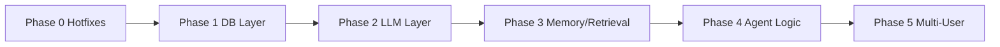
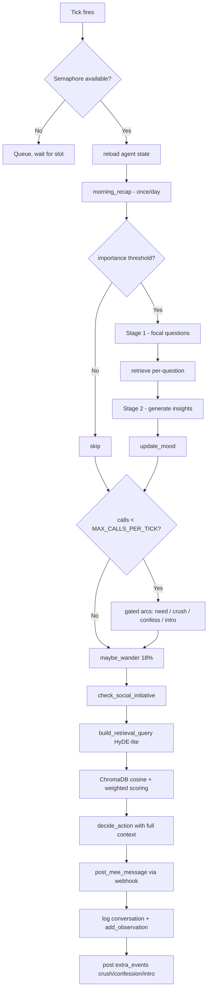
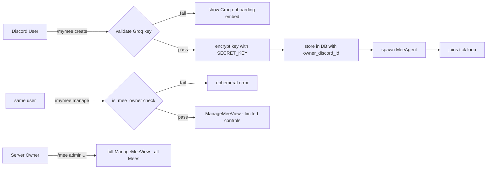

# MeeBot v4 → v5 Architecture Upgrade Plan

> Generated after full codebase audit of all 8 source files.  
> Covers: agent, memory, vector_store, llm, db, main, manage, embeds, webhook.

---

## Groq Free API Key — Feasibility Answer

**Short answer: Yes, Groq free works — but only with the optimizations in this plan.**

### Current architecture call cost per Mee per tick

| Operation | LLM calls | Frequency |
|---|---|---|
| `morning_recap` | 1 | once/day |
| `maybe_reflect` (2-stage) | up to 5 | when threshold crossed |
| `maybe_surface_need` | 1 | 10% per tick |
| `maybe_develop_crush` | 1 | 6% per tick |
| `maybe_confess` | 2-3 | 18% per tick |
| `maybe_introduce` | 1 | 4% per tick |
| `decide_action` | 1 | every tick |
| `update_relationship` (per message) | 1-3 | every human msg |
| `score_importance` | 1 per memory | every message observed |

**Worst case for one Mee in a busy server:**
- 480 ticks/day × ~7 LLM calls average = **3,360 calls/day**
- 50 messages/day × 4 calls each = **200 extra calls/day**
- **Total: ~3,560 calls/day**

**Groq free limits (llama-3.1-8b-instant):**
- 14,400 requests/day ✅ fits one Mee
- 500 req/min ✅ not at risk with 1-2 Mees
- For 5 Mees sharing the server but each with their own key: each user independently uses ~1,500-3,500 calls/day — **within limits**

**After optimizations in this plan (target: ~1,200 calls/day per Mee):**
- Groq free comfortably supports 3-4 Mees in a moderately active server
- Use `llama-3.1-8b-instant` (NOT the 70B model) — 14× more daily requests vs. 70B
- Reserve `llama-3.3-70b-versatile` (1,000 req/day) for high-stakes events only (confessions, reflections)

**Recommended Groq model routing (Mixture of Agents pattern):**

| Task | Model | Why |
|---|---|---|
| `score_importance` | `llama-3.1-8b-instant` | High frequency, simple scoring |
| `decide_action` | `llama-3.1-8b-instant` | Every tick, needs to be fast |
| `update_relationship` | `llama-3.1-8b-instant` | Frequent, simple label+score |
| `maybe_reflect` | `llama-3.3-70b-versatile` OR `llama-3.1-8b-instant` | Less frequent, quality matters |
| `build_plan` | `llama-3.1-8b-instant` | Once/day |
| Confessions / Crush ponder | `llama-3.3-70b-versatile` | Rare, dramatic, quality matters |
| Fight / Reconciliation detection | `llama-3.1-8b-instant` | Simple classification |

---

## Step 1 — Codebase Audit: Identified Flaws

### F1 · LLM Call Explosion Per Tick
**File:** [`src/agents/agent.py`](../meebot-final/src/agents/agent.py:899), [`src/agents/memory.py`](../meebot-final/src/agents/memory.py:41)  
**Severity:** 🔴 Critical

`agent.tick()` unconditionally runs up to 9 sub-routines on every tick, each of which may fire LLM calls. In a 3-Mee server with a 3-minute tick, this generates 15-45 background LLM calls per minute. Groq free tier and any rate-limited provider will choke immediately.

Additionally, `score_importance()` fires a full LLM call for every single memory inserted — one call per human message per Mee. In a busy server with 50 messages/hour, that is 50 extra calls/hour per Mee purely for importance bookkeeping.

---

### F2 · New HTTP Connection Created for Every LLM Call
**File:** [`src/agents/llm.py`](../meebot-final/src/agents/llm.py:41)  
**Severity:** 🔴 Critical

```python
async with httpx.AsyncClient(timeout=60.0) as client:
```

A brand-new `httpx.AsyncClient` (and TCP connection + TLS handshake) is created per LLM call. With 10 LLM calls per tick and N agents, this means N×10 HTTP connections opened and closed per minute with zero reuse. Adds 100-300ms latency floor per call.

The same problem exists in [`src/utils/webhook.py`](../meebot-final/src/utils/webhook.py:59):
```python
async with aiohttp.ClientSession() as session:
```
Every webhook post creates a fresh `aiohttp.ClientSession`.

---

### F3 · No Concurrency Limit on Agent Task Spawning
**File:** [`main.py`](../meebot-final/main.py:165)  
**Severity:** 🔴 Critical

```python
asyncio.create_task(
    self._run_agent_tick(agent, channel_id, all_mee_names, all_agents)
)
```

`asyncio.create_task()` is called for every agent every minute with no semaphore, no queue, no back-pressure. With 10 agents, 10 concurrent tasks are spawned simultaneously, each potentially hitting the LLM API in a burst. This creates a thundering herd that exhausts rate limits and causes SQLite lock contention.

---

### F4 · SQLite Connection-Per-Operation Pattern
**File:** [`src/utils/db.py`](../meebot-final/src/utils/db.py:183)  
**Severity:** 🟡 Medium

Every database function opens a fresh `aiosqlite.connect(DB_PATH)` connection:
```python
async with aiosqlite.connect(DB_PATH) as db:
```
This is ~5ms overhead per operation. With 20+ DB calls per agent tick, this adds 100ms+ of pure connection overhead per tick cycle. A connection pool would eliminate this entirely.

---

### F5 · Memory Retrieval Query Is Noise-Dominated
**File:** [`src/agents/agent.py`](../meebot-final/src/agents/agent.py:700)  
**Severity:** 🟡 Medium

The retrieval query is built by string-concatenating the last 5 raw chat messages:
```python
query_parts = [m["content"] for m in recent_chat[-5:]]
query = " ".join(query_parts) if query_parts else f"{self.name} thinking"
```
Raw Discord messages are short, fragmented, and filled with names/emojis. This produces a noisy, low-semantic-density retrieval query. The result is that ChromaDB's ONNX embeddings cannot find the actually relevant memories because the query vector is averaging over too many topics.

---

### F6 · Importance Scoring Fires Per-Memory Per-Insertion
**File:** [`src/agents/memory.py`](../meebot-final/src/agents/memory.py:41-58)  
**Severity:** 🟡 Medium

Both `add_observation()` and `add_conversation_memory()` call `score_importance()` which is a full LLM round-trip. These are called from `on_message()` for every human message every Mee hears. This is a constant background drain on the rate limit entirely divorced from the agent's actual conversational activity.

---

### F7 · ChromaDB Cold-Start Syncs ALL Memories
**File:** [`src/agents/memory.py`](../meebot-final/src/agents/memory.py:77)  
**Severity:** 🟡 Medium

```python
async def sync_memories_to_chroma(mee_id: int, mee_name: str):
    all_mems = await db.get_memories(mee_id, limit=500)
    for m in all_mems:
        upsert_memory(...)
```

On first access after bot restart, all 500 memories are upserted to ChromaDB synchronously (ChromaDB operations are not truly async). This blocks the event loop for several seconds and creates a latency spike on the first tick after startup.

---

### F8 · Retrieval Scoring Formula Lacks Weights and Normalization
**File:** [`src/agents/vector_store.py`](../meebot-final/src/agents/vector_store.py:117)  
**Severity:** 🟡 Medium

```python
total = recency + importance + relevance + rel_boost
```

All components are added with equal weight (1.0 each) with no explicit weighting. The Park et al. (2023) Generative Agents paper uses `α·recency + β·importance + γ·relevance` with tunable weights. Without normalization, the formula implicitly gives equal weight to recency and importance as to semantic relevance — meaning a very recent but completely off-topic memory can outscore a perfectly relevant older one.

Additionally, `memory_type` is not factored in: a `reflection` (high-level insight deliberately generated) should score higher than a raw `conversation` memory when importance scores are similar.

---

### F9 · API Keys Stored and Transmitted in Plaintext
**File:** [`src/commands/manage.py`](../meebot-final/src/commands/manage.py:54)  
**Severity:** 🔴 Critical (for multi-user deployment)

```python
api_config = discord.ui.TextInput(
    label="API Key | Model | Base URL (pipe-separated)",
    placeholder="sk-xxxx|gpt-4o-mini|https://api.openai.com/v1",
```

Users type their API key directly into a Discord modal. The key is then stored verbatim in SQLite in the `api_key` column. Anyone with read access to the `.db` file (including anyone with server access to the Docker volume) can extract all user API keys. When the Groq free key model is adopted, users' personal Groq accounts become the attack surface.

---

### F10 · All Commands Are Owner-Only — No Multi-User Model
**File:** [`src/commands/manage.py`](../meebot-final/src/commands/manage.py:24)  
**Severity:** 🔴 Critical (for multi-user deployment)

```python
def is_owner():
    async def predicate(interaction: discord.Interaction) -> bool:
        if interaction.user.id != OWNER_ID:
```

Every single `/mee` command is guarded by a single hardcoded `OWNER_ID`. There is no concept of a user owning their own Mee. There is no way for a regular Discord user to create or manage a Mee character. This is incompatible with the intended design where each user supplies their own Groq key.

---

### F11 · Relationship Updates Fire on Every Human Message
**File:** [`main.py`](../meebot-final/main.py:303)  
**Severity:** 🟡 Medium

```python
if len(content) > 10:
    asyncio.create_task(
        self._update_rel_and_events(agent, author, content, channel_id)
    )
```

`_update_rel_and_events` calls `agent.update_relationship()` which fires a full LLM call for relationship scoring — plus potentially 2 more calls for fight/reconciliation detection. Every message longer than 10 characters triggers this. In practice, most messages don't meaningfully change a relationship and don't warrant a full LLM call.

---

### F12 · No Retry or Circuit Breaker on LLM Failures
**File:** [`src/agents/llm.py`](../meebot-final/src/agents/llm.py:41)  
**Severity:** 🟡 Medium

```python
resp.raise_for_status()
```

A single 429 (rate limit) or 503 (downtime) causes the call to raise an exception that propagates up and is swallowed by caller-level `except Exception` handlers. There is no retry with backoff, no fallback to a cheaper model, and no circuit breaker to pause LLM calls when an endpoint is suffering. During Groq's occasional maintenance windows, the entire bot's agent activity goes silent without any indication.

---

### F13 · `touch_memory` Fires N Sequential DB Writes Per Retrieval
**File:** [`src/agents/memory.py`](../meebot-final/src/agents/memory.py:67)  
**Severity:** 🟢 Low

```python
for m in results:
    await db.touch_memory(m["id"])
```

`top_k=8` retrieved memories result in 8 sequential `UPDATE` SQL queries, each opening a new connection (F4). This could be a single `WHERE id IN (...)` query.

---

### F14 · `embeds.py` Icon Map Is Stale After v4 Event Types
**File:** [`src/utils/embeds.py`](../meebot-final/src/utils/embeds.py:74)  
**Severity:** 🟢 Low

The `world_event_embed()` function only knows v2 event types (`movement`, `arrival`, `departure`, `update`, `event`). The v4 `main.py` defines `EVENT_ICONS` with 12 types including `relationship`, `fight`, `reconciliation`, `crush`, `confession`, `introduction`, `need`. These new types fall through to the default `🌍` icon, losing all visual differentiation.

---

### F15 · Webhook Post Mutates Global Session State Per Call
**File:** [`src/utils/webhook.py`](../meebot-final/src/utils/webhook.py:59)  
**Severity:** 🟢 Low

Each `post_as_mee()` call creates a fresh `aiohttp.ClientSession()`. Same anti-pattern as F2. In a server with 5 Mees posting frequently, there are 5 simultaneous `aiohttp` sessions being created and destroyed per minute.

---

### F16 · ChromaDB Retrieval Scoring Has No Memory Type Weighting
**File:** [`src/agents/vector_store.py`](../meebot-final/src/agents/vector_store.py:141)  
**Severity:** 🟢 Low

`memory_type` is stored in metadata but never used in the scoring formula. A `reflection` that an agent deliberately formed should be weighted more than a raw `conversation` line. Without this, low-quality noise memories dilute retrieval quality as the pool grows.

---

## Step 2 — Researched Solutions

### S1 · LLM Call Budget + Batching (solves F1, F6, F11)

**Pattern: Per-tick call budget + batch importance scoring**

Introduce a per-tick LLM call budget (e.g., 5 max per tick per agent). Gate expensive arcs behind:
1. Their random chance (already present), AND
2. `calls_this_tick < MAX_CALLS_PER_TICK`

**Batch importance scoring:** Instead of scoring each memory individually (1 call each), batch up to 5 memories in a single prompt:

```
Rate each of these memories 1-10. Return ONLY JSON:
{"scores": [<n1>, <n2>, <n3>]}
```

This converts N sequential LLM calls into 1 call per N memories.

**Relationship update gating:** Only fire `update_relationship()` when:
- The message mentions the Mee's name, OR
- A simple sentiment heuristic flags strong emotion (keyword list: "hate", "love", "angry", "miss", etc.), OR  
- A 15% random gate fires for ambient drift

This reduces relationship LLM calls by ~85%.

---

### S2 · Persistent HTTP Client Pool (solves F2, F15)

**Pattern: Module-level long-lived HTTP client**

```python
# In llm.py — module level
_http_client: httpx.AsyncClient | None = None

def get_http_client() -> httpx.AsyncClient:
    global _http_client
    if _http_client is None or _http_client.is_closed:
        _http_client = httpx.AsyncClient(
            timeout=httpx.Timeout(connect=5.0, read=60.0, write=10.0, pool=5.0),
            limits=httpx.Limits(max_keepalive_connections=20, max_connections=100),
        )
    return _http_client
```

The client lives for the bot's lifetime, reuses TCP connections via keep-alive, eliminating 100-300ms per-call TLS handshake overhead.

For webhooks: `MeeBot` creates one `aiohttp.ClientSession` in `setup_hook()` and passes it to the webhook utility, closing it in `async def close()`.

---

### S3 · Asyncio Semaphore for Tick Concurrency (solves F3)

**Pattern: Bounded concurrency with `asyncio.Semaphore`**

```python
class MeeBot(commands.Bot):
    def __init__(self):
        ...
        self._tick_semaphore = asyncio.Semaphore(3)  # max 3 concurrent agent ticks

    async def agent_tick_loop(self):
        for agent in all_agents:
            asyncio.create_task(
                self._guarded_tick(agent, channel_id, all_mee_names, all_agents)
            )

    async def _guarded_tick(self, agent, *args, **kwargs):
        async with self._tick_semaphore:
            await self._run_agent_tick(agent, *args, **kwargs)
```

Maximum 3 agents run their full tick pipeline simultaneously, regardless of total Mee count. New ticks queue up and execute as slots become free.

---

### S4 · Persistent SQLite Connection Pool (solves F4, F13)

**Pattern: Module-level connection with asyncio.Lock**

```python
# db.py
_conn: aiosqlite.Connection | None = None
_lock = asyncio.Lock()

async def get_conn() -> aiosqlite.Connection:
    global _conn
    if _conn is None:
        _conn = await aiosqlite.connect(DB_PATH)
        _conn.row_factory = aiosqlite.Row
        await _conn.execute("PRAGMA journal_mode=WAL")
        await _conn.execute("PRAGMA foreign_keys=ON")
    return _conn
```

All DB functions use `async with _lock: conn = await get_conn()` instead of opening new connections. One persistent connection, locked per operation, eliminates per-call connect overhead.

**Batch `touch_memory`:**
```python
async def touch_memories(memory_ids: list[int]):
    placeholders = ",".join("?" * len(memory_ids))
    async with _lock:
        conn = await get_conn()
        await conn.execute(
            f"UPDATE memories SET last_accessed=datetime('now'), "
            f"access_count=access_count+1 WHERE id IN ({placeholders})",
            memory_ids
        )
        await conn.commit()
```

---

### S5 · HyDE-Lite Query Construction (solves F5)

**Pattern: Hypothetical Document Embedding (lightweight)**

From the RAG literature (Gao et al., 2022 "Precise Zero-Shot Dense Retrieval without Relevance Labels"), the HyDE technique generates a hypothetical answer/memory first, then embeds that for retrieval — producing far better semantic alignment than embedding the raw query.

Lightweight implementation for MeeBot (no extra LLM call needed):

```python
def _build_retrieval_query(self, recent_chat: list[dict], 
                            pending_addressed: list[dict]) -> str:
    # Extract the most meaningful recent message (last human message or addressed)
    focus = ""
    if pending_addressed:
        focus = pending_addressed[-1]["content"]
    else:
        human_msgs = [m for m in recent_chat[-5:] if not m.get("is_mee")]
        if human_msgs:
            focus = human_msgs[-1]["content"]
        elif recent_chat:
            focus = recent_chat[-1]["content"]
    
    # Construct a first-person memory-like query
    if focus:
        return f"{self.name} remembers something relevant to: {focus}"
    return f"{self.name} thinking about recent events and relationships"
```

For a full HyDE upgrade: generate a short "hypothetical memory" via one fast LLM call, then embed that for retrieval. This is a configurable upgrade path.

---

### S6 · Incremental ChromaDB Sync (solves F7)

**Pattern: Watermark-based incremental sync**

```python
async def _ensure_chroma_synced(self):
    if not self._chroma_synced:
        # Only sync memories from last 7 days on startup
        cutoff = (datetime.now(timezone.utc) - timedelta(days=7)).isoformat()
        recent_mems = await db.get_memories_since(self.id, since=cutoff, limit=200)
        for m in recent_mems:
            upsert_memory(...)
        self._chroma_synced = True
        self._chroma_watermark = datetime.now(timezone.utc).isoformat()
```

New memories are still incrementally upserted in `add_observation()` / `add_conversation_memory()` as they are created. Cold start only syncs the recent window instead of the entire history.

---

### S7 · Weighted Retrieval Scoring per Generative Agents Paper (solves F8, F16)

**Pattern: Explicit weighted multi-factor scoring**

Following Park et al. (2023), Section 2.1:

```python
WEIGHTS = {
    "relevance":   0.40,
    "importance":  0.30,
    "recency":     0.20,
    "rel_boost":   0.10,
}

TYPE_BONUS = {
    "reflection":     0.12,
    "morning_recap":  0.08,
    "observation":    0.00,
    "conversation":  -0.05,  # raw chat, lower signal
}

total = (
    WEIGHTS["relevance"]  * relevance +
    WEIGHTS["importance"] * importance_normalized +
    WEIGHTS["recency"]    * recency +
    WEIGHTS["rel_boost"]  * rel_boost +
    TYPE_BONUS.get(mem["memory_type"], 0.0)
)
```

All scores remain in the [0,1] range before weighting, making the formula interpretable and tunable.

---

### S8 · API Key Encryption with Fernet (solves F9)

**Pattern: Symmetric encryption with app-level secret**

```python
# db.py
from cryptography.fernet import Fernet

def _get_cipher() -> Fernet:
    key = os.getenv("SECRET_KEY", "")
    if not key:
        raise RuntimeError("SECRET_KEY env var must be set for API key encryption")
    return Fernet(key.encode())

def encrypt_key(api_key: str) -> str:
    return _get_cipher().encrypt(api_key.encode()).decode()

def decrypt_key(encrypted: str) -> str:
    return _get_cipher().decrypt(encrypted.encode()).decode()
```

Keys are encrypted before being written to the DB and decrypted when the `LLMClient` is constructed. The `SECRET_KEY` env var is a Fernet key generated once at deployment (`Fernet.generate_key()`).

**New `.env.example` entry:**
```
SECRET_KEY=<generate with: python -c "from cryptography.fernet import Fernet; print(Fernet.generate_key().decode())">
```

---

### S9 · Multi-User Permission Model (solves F10)

**Pattern: Discord user-scoped ownership with role/guild gating**

**DB change:** Add `owner_discord_id TEXT NOT NULL DEFAULT '0'` to the `mees` table.

**Command architecture split:**

```
/mee admin ...       → owner-only (OWNER_ID env var), manages all Mees
/mymee create        → any server member, creates their own Mee
/mymee manage        → user sees and edits only their own Mee
/mymee delete        → user deletes only their Mee
/mymee summon        → user summons only their Mee
```

**Creation flow for users:**
1. User runs `/mymee create`
2. Modal prompts: Name, Identity, Traits, Goals, Groq API Key
3. Bot validates the Groq key with a test call before saving
4. Key is encrypted (S8) and stored with `owner_discord_id = interaction.user.id`
5. Server admin can optionally set a `REQUIRE_ROLE_ID` env that gates who can create Mees

**One Mee per user limit:** Enforced by checking `owner_discord_id` on create. Configurable via `MAX_MEES_PER_USER` env var.

---

### S10 · Retry with Exponential Backoff + Circuit Breaker (solves F12)

**Pattern: Tenacity-style retry decorator**

```python
import asyncio, time

async def _complete_with_retry(self, messages, max_tokens, temperature, 
                                json_mode, max_retries=3) -> str:
    delay = 1.0
    for attempt in range(max_retries):
        try:
            return await self._complete_once(messages, max_tokens, 
                                              temperature, json_mode)
        except httpx.HTTPStatusError as e:
            if e.response.status_code in (429, 503, 500):
                if attempt < max_retries - 1:
                    await asyncio.sleep(delay)
                    delay *= 2  # exponential backoff: 1s → 2s → 4s
                    continue
            raise
        except httpx.TimeoutException:
            if attempt < max_retries - 1:
                await asyncio.sleep(delay)
                delay *= 2
                continue
            raise
    raise RuntimeError("Max retries exceeded")
```

**Circuit breaker:** `LLMClient` tracks `_consecutive_failures`. If ≥ 3, it sets `_circuit_open_until = time.time() + 300` (5 min). Calls during this window return `None` immediately and log a warning, allowing the rest of the tick to proceed without blocking.

---

### S11 · Model Routing — Mixture of Agents (solves F1, complements S1)

**Pattern: Two-tier model routing per operation type**

Each `LLMClient` gets a `fast_model` and `quality_model` parameter. Operations are tagged with their tier:

```python
# In agent.py
QUALITY_OPS = {"reflection", "confession", "crush_ponder", "plan"}
FAST_OPS    = {"importance", "action", "relationship", "need", 
               "fight_check", "reconciliation_check", "mood"}

async def _call_llm(self, op_type: str, messages, **kwargs):
    model = (self.llm.quality_model 
             if op_type in QUALITY_OPS 
             else self.llm.fast_model)
    return await self.llm.complete(messages, model_override=model, **kwargs)
```

For Groq users: `fast_model = "llama-3.1-8b-instant"`, `quality_model = "llama-3.3-70b-versatile"`. High-drama/quality operations are routed to the better model; routine operations use the fast model. Daily call totals stay within free tier limits.

---

## Step 3 — Technical Roadmap

### Phase 0 — Hotfixes (no behaviour change, implement first)

These fix bugs and inefficiencies with no observable behaviour change. Implement in a single PR.

| # | Task | File(s) | Flaw |
|---|---|---|---|
| 0.1 | Replace per-call `httpx.AsyncClient` with module-level persistent client | `llm.py` | F2 |
| 0.2 | Replace per-call `aiohttp.ClientSession` with bot-lifetime session | `webhook.py`, `main.py` | F2/F15 |
| 0.3 | Replace `touch_memory` N×1 with single batch UPDATE | `db.py`, `memory.py` | F13 |
| 0.4 | Update `world_event_embed()` icon map with all v4 event types | `embeds.py` | F14 |
| 0.5 | Fix `manage.py` autocomplete decoration order | `commands/manage.py` | F14 |



---

### Phase 1 — Database Layer Upgrade

**Goal:** Eliminate per-call connection overhead. Add encryption support. Add owner column.

**1.1 — Persistent connection pool in `db.py`**

- Replace every `async with aiosqlite.connect(DB_PATH) as db:` with `async with _db_lock: conn = await get_conn(); conn.row_factory = aiosqlite.Row`
- Add `_conn`, `_db_lock`, `get_conn()`, `close_conn()` at module level
- Call `close_conn()` in `MeeBot.close()` override

**1.2 — Batch `touch_memory`**

- Add `touch_memories(ids: list[int])` function with `WHERE id IN (...)`
- Update callers in `memory.py`

**1.3 — `get_memories_since(mee_id, since_iso, limit)` query**

- Used by incremental ChromaDB sync

**1.4 — Add `owner_discord_id` column to `mees` table**

- Add to `CREATE TABLE` and `ALTER TABLE` migration block
- Add to `create_mee()`, `get_mee()`, `_parse_mee()`

**1.5 — Encrypted key storage**

- Add `encrypt_key()` / `decrypt_key()` using `cryptography.fernet.Fernet`
- `create_mee()` encrypts `api_key` before insert
- `_parse_mee()` decrypts `api_key` after fetch
- Add `SECRET_KEY` to `.env.example` and `docker-compose.yml`
- Add `cryptography` to `requirements.txt`

---

### Phase 2 — LLM Client Upgrade

**Goal:** Persistent HTTP pool, retry/circuit breaker, model routing, batch scoring.

**2.1 — Persistent `httpx.AsyncClient`**

- Module-level `_http_client` in `llm.py`
- `get_http_client()` accessor
- `close_http_client()` called in `MeeBot.close()`

**2.2 — Retry with exponential backoff**

- Wrap `_complete_once()` with `_complete_with_retry()`
- 3 attempts, 1s→2s→4s backoff, retries on 429/500/503/timeouts
- Public `complete()` delegates to `_complete_with_retry()`

**2.3 — Circuit breaker**

- `_consecutive_failures: int = 0` on `LLMClient`
- `_circuit_open_until: float = 0.0`
- On open circuit, `complete()` logs warning and returns `""` (callers already handle empty/None)
- Reset on successful call

**2.4 — Model routing**

- `LLMClient` gains `fast_model: str` and `quality_model: str`
- `complete()` accepts optional `model_override: str`
- `LLMClient` constructed from mee data: `fast_model=mee["model"]`, `quality_model=mee.get("quality_model", mee["model"])`
- New DB column `quality_model TEXT DEFAULT NULL` (NULL means same as fast model)

**2.5 — Batch importance scoring**

- New prompt `build_batch_importance_prompt(memory_list: list[str])` returning `{"scores": [n1, n2, ...]}`
- New `score_importance_batch(llm, contents: list[str]) -> list[float]`
- Buffer memories to score in groups of 5 before firing LLM call

---

### Phase 3 — Memory and Retrieval Upgrade

**Goal:** Better retrieval query, weighted scoring, incremental ChromaDB sync.

**3.1 — HyDE-lite query construction in `agent.py`**

- Replace raw message concatenation with `_build_retrieval_query()`
- Structured first-person framing: `"{self.name} remembers something about: {focus}"`
- Focus extracted from: pending addressed → last human message → topic keyword extraction

**3.2 — Weighted scoring formula in `vector_store.py`**

- Replace `total = recency + importance + relevance + rel_boost` with explicit weights
- Add `TYPE_BONUS` dict for memory_type bonuses
- Add constants `RETRIEVAL_WEIGHTS` (tunable via env vars)

**3.3 — Incremental ChromaDB sync**

- `_chroma_synced` → replace with `_chroma_watermark: str | None`
- `_ensure_chroma_synced()` uses `get_memories_since()` with 7-day window on startup
- After sync: `_chroma_watermark = datetime.now(timezone.utc).isoformat()`

**3.4 — LLM call budget per tick**

- Add `_calls_this_tick: int = 0` reset at start of each `tick()`
- After each LLM call in agent methods: `self._calls_this_tick += 1`
- Gate `maybe_confess`, `maybe_introduce`, `maybe_develop_crush` behind `self._calls_this_tick < MAX_CALLS_PER_TICK` (default: 8)

---

### Phase 4 — Agent Logic Upgrade

**Goal:** Smart relationship update gating, Maslow-aware tick skipping, better social initiative.

**4.1 — Relationship update gate**

- `_should_update_relationship(content: str, mee_name: str) -> bool`:
  ```python
  SENTIMENT_KEYWORDS = {"love", "hate", "angry", "miss", "sorry", "afraid", 
                        "happy", "sad", "hurt", "wonderful", "terrible"}
  if mee_name.lower() in content.lower(): return True
  if any(w in content.lower() for w in SENTIMENT_KEYWORDS): return True
  if random.random() < 0.15: return True  # ambient drift
  return False
  ```
- In `on_message()`: wrap `_update_rel_and_events` call behind this gate

**4.2 — Tick priority system**

- Split tick into ALWAYS and GATED sections:
  - ALWAYS: `morning_recap`, `maybe_reflect`, `decide_action`
  - GATED (only if `calls_this_tick < budget`): `maybe_surface_need`, `maybe_develop_crush`, `maybe_confess`, `maybe_introduce`
- If the agent hasn't spoken in 2× the normal interval, skip GATED entirely and only do ALWAYS

**4.3 — Excitement-aware planning**

- Morning planning prompt now includes current channel excitement level as context
- High excitement → plan includes more social, reactive items
- Low excitement (quiet server) → plan includes more introspective, location-based items

---

### Phase 5 — Multi-User Model

**Goal:** Any Discord user can create and own their Mee with their own Groq key.

**5.1 — New `/mymee` command group in `manage.py`**

```python
mymee_group = app_commands.Group(name="mymee", description="Create and manage your own Mee")
```

**5.2 — User creation flow**

- `/mymee create` → modal: Name, Identity, Traits, Goals, Groq API Key
- On submit: validate key with a minimal test call (`GET /models` or a 1-token completion)
- If validation fails: return error with instructions to get a free Groq key
- If valid: encrypt key (Phase 1.5), create Mee with `owner_discord_id = interaction.user.id`
- Auto-webhook in current channel

**5.3 — Ownership predicate**

```python
async def is_mee_owner(interaction: discord.Interaction, mee_name: str) -> bool:
    mee = await db.get_mee(mee_name)
    if not mee:
        return False
    return (str(interaction.user.id) == str(mee.get("owner_discord_id"))
            or interaction.user.id == OWNER_ID)
```

**5.4 — User commands: `/mymee manage`, `/mymee summon`, `/mymee delete`**

- All go through `is_mee_owner()` predicate
- `/mymee manage` shows a simplified management view (edit identity, traits, image only — not model settings to prevent abuse)
- Server admin (`OWNER_ID`) retains full access to all Mees

**5.5 — Key validation helper**

```python
async def validate_groq_key(api_key: str) -> bool:
    try:
        client = LLMClient(api_key, "llama-3.1-8b-instant", 
                           "https://api.groq.com/openai/v1")
        result = await client.complete(
            [{"role": "user", "content": "Hi"}], max_tokens=5
        )
        return bool(result)
    except Exception:
        return False
```

**5.6 — Groq onboarding embed**

- When `/mymee create` is run without a key: send an ephemeral embed explaining:
  - How to get a free Groq key at console.groq.com
  - Which model to use (`llama-3.1-8b-instant`)
  - Rate limits and what they mean for their Mee

---

## File Change Summary

| File | Changes | Priority |
|---|---|---|
| [`src/utils/db.py`](../meebot-final/src/utils/db.py) | Persistent connection, batch touch, `get_memories_since`, owner column, key encryption | Phase 1 |
| [`src/agents/llm.py`](../meebot-final/src/agents/llm.py) | Persistent HTTP client, retry, circuit breaker, model routing, batch importance prompt | Phase 2 |
| [`src/agents/memory.py`](../meebot-final/src/agents/memory.py) | Incremental Chroma sync, batch importance scoring, HyDE-lite query | Phase 3 |
| [`src/agents/vector_store.py`](../meebot-final/src/agents/vector_store.py) | Weighted scoring formula, memory_type bonus, tunable weights | Phase 3 |
| [`src/agents/agent.py`](../meebot-final/src/agents/agent.py) | Call budget, relationship gate, model routing calls, priority tick split | Phase 4 |
| [`main.py`](../meebot-final/main.py) | Semaphore, bot-lifetime HTTP session, `close()` override | Phase 0+3 |
| [`src/commands/manage.py`](../meebot-final/src/commands/manage.py) | `/mymee` group, user create/manage/delete, `is_mee_owner`, Groq onboarding embed | Phase 5 |
| [`src/utils/embeds.py`](../meebot-final/src/utils/embeds.py) | Full v4 icon map in `world_event_embed()`, Groq onboarding embed helper | Phase 0+5 |
| [`src/utils/webhook.py`](../meebot-final/src/utils/webhook.py) | Accept bot-lifetime `aiohttp.ClientSession`, remove per-call session | Phase 0 |
| [`requirements.txt`](../meebot-final/requirements.txt) | Add `cryptography>=42.0.0` | Phase 1 |
| [`.env.example`](../meebot-final/.env.example) | Add `SECRET_KEY`, `MAX_MEES_PER_USER`, `REQUIRE_ROLE_ID`, `MAX_CALLS_PER_TICK` | Phase 1+5 |
| [`docker-compose.yml`](../meebot-final/docker-compose.yml) | Add `SECRET_KEY`, `SPOKE_COOLDOWN_MIN`, fix missing `SPOKE_COOLDOWN_MIN` env pass-through | Phase 1 |

---

## New Environment Variables

```env
# Security (REQUIRED for multi-user deployment)
SECRET_KEY=                          # Fernet key for API key encryption

# Multi-user control
MAX_MEES_PER_USER=1                  # Max Mees a single Discord user can create
REQUIRE_ROLE_ID=                     # Optional: Discord role ID required to create Mees

# LLM call budget per tick
MAX_CALLS_PER_TICK=8                 # Cap LLM calls per agent per tick

# Model routing
DEFAULT_FAST_MODEL=llama-3.1-8b-instant     # For Groq users
DEFAULT_QUALITY_MODEL=llama-3.3-70b-versatile  # For Groq users (low-frequency ops)
```

---

## Mermaid: Upgraded Tick Pipeline



---

## Mermaid: Multi-User Permission Flow



---

## Quick Reference: Groq Free Tier After Optimizations

| Scenario | Calls/day per Mee | Fits 14,400 limit? |
|---|---|---|
| Current architecture, busy server | 3,500-5,000 | ⚠️ barely (1 Mee only) |
| After Phase 0-2 (HTTP + retry) | 2,500-3,000 | ✅ 4 Mees |
| After Phase 3-4 (budget + gating) | 800-1,200 | ✅ 10+ Mees |
| Recommended production target | ~1,000 | ✅ comfortable |

**Model recommendation for Groq free users:**
- Primary: `llama-3.1-8b-instant` — fast, 14,400 req/day, excellent for Discord character AI
- Quality ops: `llama-3.3-70b-versatile` — 1,000 req/day, use sparingly for confessions/reflections
- Do NOT default to 70B — users will hit the 1,000 req/day wall within hours

---

*Plan ready for implementation. Suggested first PR: Phase 0 hotfixes (all pure refactors, zero behaviour change, immediately shippable).*
